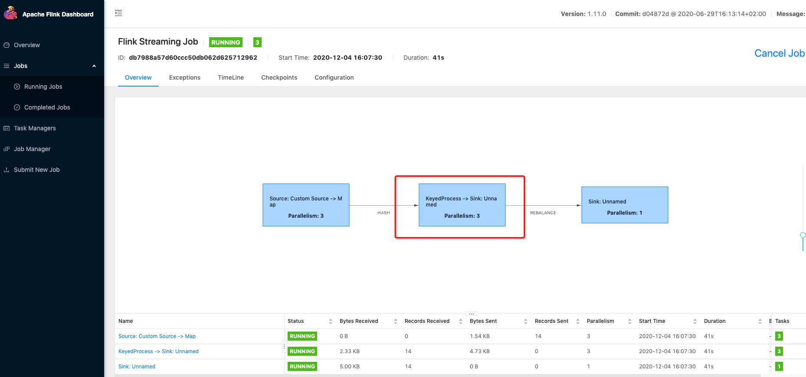
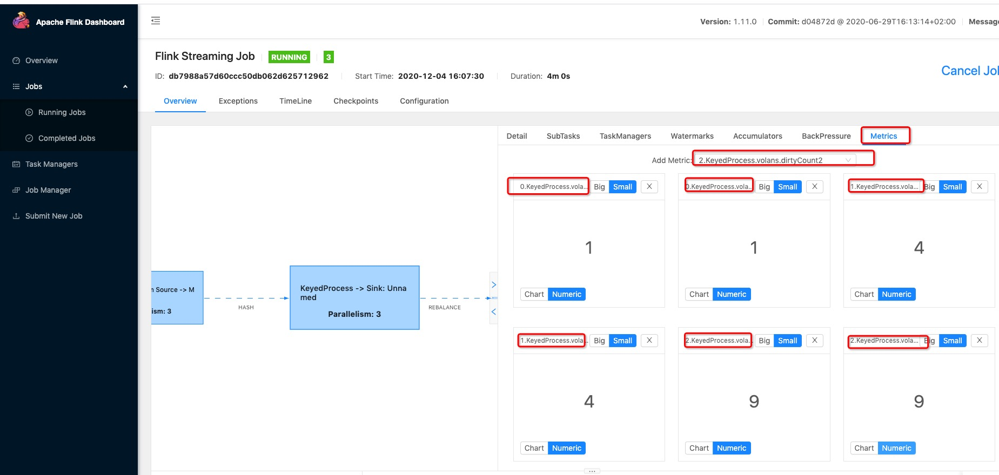

# volans-2.32.0版本
## 简介
    volans提 供了从kafka实时接入到GDB, ES, HBASE, HIVE等组件的流式接入功能，volans采用最新一代流式处理框架flink作为流式处理核心组件
    
### 模块说明

|模块|类型|端口|用途|
|:-----|:-----|:-----|------------------------------------- |
|**volans-common-flink-base** |**jar**  |无    |公共包 |
|**volans-flink-loader** |**jar**  |无    | 流式处理核心模块 |
|**volans-flink-sink** |**jar**  |无    | 数据接入下游组件核心模块 |

### 编译
```shell script
cd volans
mvn -U  clean compile install  -DskipTests 
```
### 打包
```shell script
cd volans-flink-loader
mvn -U  clean compile package  -DskipTests -DnewVersion=2.32.0 -Ploader-deploy
```
### 私服
```shell script
cd volans
mvn -U  clean compile deploy  -DskipTests -DnewVersion=2.32.0 
```

## 开发说明
一、项目运行需要指定 -input configure.json 参数:  
 1、IDEA调试时可在RUN -> edit configuration 中指定参数，例如：  
-input /Users/hzxt/project/IDEA_HZXT/volans-flink/volans/volans-flink-loader/src/main/resources/dev-conf/configure.json  
 2、集群环境调试只需在脚本后加入参数即可，例如： sh bin/yarn_run.sh /home/work/volans/configure  

二、本地IDEA运行时需指定 Profiles -> add-dependencies-for-IDEA  
三、项目运行主类：volans-flink-loader -> scala -> StartFlinkLoader  
四、脚本目录: volans-flink-loader -> bin  
五、本地调用集群环境时，需将集群中配置文件放置到volans-flink-loader -> resources目录下，可参考prod-conf目录下配置文件  


## configure.json 参数说明
```json
{
  "errorInfo": {          
    "dirtyData": {              // 脏数据配置
      "storeType": "file",      // 脏数据输出为file文件
      "handleMode": -1,         // 错误处理方式，-1表示出错继续，大于或等于0表示错误行大于该值终止
      "storeEnabled": true,     // 是否开启错误信息记录
      "storeRowsLimit": 30000,  // 限制错误信息记录条数
      "inboundTaskId": "7083-HBASE",
      "taskInstanceId": "7083", // 作业唯一ID
      "config": {
        "path": "hdfs:///tmp/volans3/groupId/dirty_data"  // 脏数据存储路径，本地为 file:///
      }
    },
    "logInfo": {                // 作业异常信息配置
      "storeType": "file",      // 异常信息输出为file文件
      "config": {
        "path": "hdfs:///tmp/volans2/groupId/taskInstanceId/log_info" // 异常数据存储路径，本地为 file:///
      }
    }
  },
  "taskConfig": {               // flink配置类
    "checkPoint": "hdfs:///tmp/volans2/checkpoints/gourpId",  // 检查点目录，本地为file:///
    "parallelism": 3,           // 并行度设置
    "checkpointInterval": 1000 * 60 * 10, // 检查点时间周期，单位为毫秒，不填默认为10分钟
    "batchInterval": 1000 * 60 * 10,      // 批次写入到下游组件的时间周期，单位为毫秒，不填默认为10分钟
    "restart": 3,               // 流式作业突发异常导致程序中断后的重启次数，不填默认为 3 次
    "config": {                 // 可扩展参数，将添加到flink config
    }
  },
  "schema": {                   // kafka中数据schema配置
    "fields": [
      {                         // 字段映射关系
        "sourceName": "$.from_key",  // kafka中数据jsonPath
        "isMain": "Y",               // 字段是否必填，Y为必填，N为不必填
        "targetName": "from_key",    // 映射后的字段名
        "type": "STRING"             // 字段类型
      },
     {                          // operation字段，对应下面 operation 配置, 只有在mode为MIX模式下才有此字段
       "sourceName": "$._operation",
       "isMain": "Y",
       "targetName": "_operation",
       "type": "STRING"
     }
    ],
    "name": "com_new_vertex_tv_user_shanghai_1",  // 2.32.0版本暂时无用，后续如果多表插入时，提供多表表名
    "type": "edge",             // 标识入库是点入库还是边入库
    "operation": {              // 数据接入配置
      "mode": "UPSERT",         // 目前2.32.0 数据接入模式只有两种： UPSERT / MIX
      "operateField": "_operation"  // 只有在mode 为MIX 时，才需配置此字段，该字段用于标识 kafka中数据处理类型的targetName， 对应fields中targetName 
    }
  },
  "sinks": [
    {                           // HBASE Sink 配置， 必填项： URL / table  
      "storeType": "HBASE",
      "storeConfig": {
        "url": "192.168.1.131,192.168.1.132,192.168.1.134:2181",
        "namespace": "default",
        "table": "flink_test.person",
        "logicPartitions": 1000,
        "physicsPartitions": 16,
        "config": {
        }
      }
    },
    {
      "storeType": "ES",         // HBASE Sink 配置， 必填项： URL / INDEX / TYPE  
      "storeConfig": {
        "index": "benchmark.company",
        "type": "company",
        "url": "192.168.2.71:9200",
        "mapping": {
          "dynamic_date_formats": [
            "yyyy-MM-dd HH:mm:ss",
            "yyyy-MM-dd"
          ],
          "dynamic_templates": [
            {
              "strings": {
                "mapping": {
                  "analyzer": "ik",
                  "type": "text",
                  "fields": {
                    "keyword": {
                      "normalizer": "my_normalizer",
                      "type": "keyword"
                    }
                  }
                },
                "match_mapping_type": "string"
              }
            }
          ],
          "_all": {
            "enabled": false
          },
          "date_detection": true
        },
        "setting": {
          "analysis": {
            "normalizer": {
              "my_normalizer": {
                "filter": [
                  "lowercase",
                  "asciifolding"
                ],
                "char_filter": [
                ],
                "type": "custom"
              }
            },
            "analyzer": {
              "ik": {
                "type": "custom",
                "tokenizer": "ik_max_word"
              }
            }
          },
          "index.number_of_replicas": 1,
          "index.number_of_shards": 5
        },
        "nativeConfig": {
        }
      }
    },
    {                            // GDB Sink 配置， 必填项： URL / USER / PASSWORD / DATABASE / COLLECTION
      "storeType": "GDB",
      "storeConfig": {
        "database": "Graph_CDH570",
        "collection": "arangoDBTest",
        "maxConnections": 5,
        "numberOfShards": 9,
        "password": "haizhi",
        "replicationFactor": 1,
        "url": "192.168.1.37:8529",
        "user": "haizhi"
      }
    },
    {
      "storeType": "HIVE",           // HIVE Sink 配置， 必填项： DATABASE / TABLE
      "storeConfig": {
        "database": "bigdata_test",
        "table": "tv_user4",
        "rollingPolicy": {
          "rolloverEnable": true,
          "maxPartSize": 128,
          "rolloverInterval": 60,
          "inactivityInterval": 60
        }
      }
    }
  ],
  "sources": [                  // source数据源配置
    {                               
      "storeType": "KAFKA",     // 2.32.0版本只支持kafka数据源, 必填项： servers / topic 
      "storeConfig": {
        "servers": "cmb01:9092",
        "groupId": "grouoId02", // 消费者组ID, 不填默认为：flink-loader
        "topic": "flink_topic2", 
        "config": {
        }
      }
    }
  ]
}
```
 ## 程序启动
 程序启动分两种：local 和 on yarn  
 1.local模式下执行bin 目录下 local_run.sh 指定 -input 参数，对照脚本中 -m you_flink_master服务器启动即可    
 2.on yarn 模式下执行bin 目录下 yarn_run.sh 指定 -inut 参数即可  
 
 
 ## 程序暂停
 
 程序运行中如需人为手动暂停，需要触发savepoint, bin目录下提供了两种停止作业脚本：  
 1. 本地停止脚本: local_stop.sh  
    需要提供暂停作业的jobID, 在flinkUI中即可找到
 
 2. flink on yarn 模式下停止脚本: yarn_stop.sh， 需要提供三种参数：    
    2.1、 存储savepoint的hdfs路径，例如：hdfs:///tmp/savepoint  
    2.2、 flink作业运行的jobID, 可以在yarnUI界面中找到ApplicationMaster UI 查看 flinkUI 找到作业ID  
    2.3、 flink on yarn 时yarn的applicationID， 可在yarnUI界面中找到，例如：application_1606384352579_1291  

 ## 程序恢复

flink程序恢复分三种情况：savepoint恢复、checkpoint恢复、无checkpoint/savepoint 从kafka根据groupID获取offset恢复，这三种情况不区分local模式还是on yarn模式
1. savepoint恢复的前提是作业是触发savepoint保存点暂停的(此时会有savepoint保存路径)，如果是非预见性异常导致中断，则只能根据checkpoint处恢复  
恢复脚本在 bin目录下  yarn_restart.sh / lcoal_restart.sh  
例如： sh bin/yarn_restart.sh  hdfs:///tmp/volans/savepoints/savepoint-40dcc6-a90008f0f82f 

2. checkpoint恢复通常用于非预见性异常导致程序中断，此时没有savepoint保存点，就需要checkpoint恢复作业
恢复脚本同样是: yarn_restart.sh / lcoal_restart.sh 只不过传参路径有所变化
例如: sh bin/yarn_restart.sh hdfs:///tmp/volans/checkpoints/ec53626575215839833cacdbffd351f7/chk-34/_metadata  注意：checkpoint恢复时路径需要指定到具体的_metadata  

3. 如果不通过checkpoint和 savepoint ，那就需要通过kafka中上次groupID提交的offset来进行恢复，由于业务需求，此版本2.32.0 是使用这种方式恢复，恢复时无需指定路径，按照local_run.sh / yarn_run.sh 启动程序即可  

 ## 度量系统：消费数量统计及脏数据统计
 1. 在flinkUI界面中点击正在运行的作业，由于消费数量统计及脏数据数量在keyedProcess算子中，所以需要点击此算子，例如：  
  
 2.度量个数和并行度有关，例如并行度为3， 那么就会有6个度量值，3个消费数量度量值，3个脏数据数量度量值
  
  
 3.关于REST API请求获取度量值, 详见 /documentation/Flink状态获取.docx
 
 ## 合理并行度
 合理计算flink的并行度是非常重要的，由于本版本2.23.0是和kafka紧密结合，所以flink并行度和kafka topic的partition个数有关,  
 在flink中，消费kafka中的partition合理分配到taskManager十分重要，在flink内部是利用hash散列的思想来分配kafka partition到taskManager中,  
 在flink中可以简单认为分配算法为：partition.getPartition() % numParallelSubtasks;  
 由此可以得知如果flink并行度 大于 partition总数，那么多余的并行度分配不到 partition，该并行度也就不会有数据形成浪费,  
 所以用户在设置flink并行度时应 <= partition总数, 这里建议flink并行度和kafka partition总数保持一致！  
 
  ## 设置并行度
 flink设置并行度方式分两种情况：程序中执行环境指定、脚本指定  
 
 1.程序指定:  
 通过configure.json -> taskConfig -> parallelism 指定并行度，从而在程序层面指定并行度创建flink env  
 程序指定的优先级为最高级，即当程序指定并行度时，外部无需再指定，即使指定也会以程序设置的并行度为主，所以bin/local_run.sh 中没有设置 -p 指定并行度  
 注意：on yarn模式下除外 
 
 2.脚本指定:  
 local模式下如果configure.json 中指定了并行度则无需再从脚本上指定，但是从flink1.5版本后on yarn 模式依然需要指定并行度 
 这里摘自官网的一句话：Flink on YARN时的容器数量——亦即TaskManager数量——将由程序的并行度自动推算 
 因为on yarn是容器启动，而容器个数需要通过脚本中的 -p 和 -ys 来计算，ys 为一个taskManager中的slots的个数，相当于yarn中container的cores个数  
 如果on yarn模式下不指定-p 和 -ys 那么只会有两个容器jobManager, taskManager, 实际生产中我们建议container 个数和flink并行度保持一致  
 例如：-p 3 -ys 1  那么此时就是有4个container， 一个jobManager, 三个 taskManager
 
 
 
 ## 生产环境 FLINK 集成 HADOOP 注意事项
 
 
 ## Hive Sink 注意事项
 

 ## 关于日志
 
 
 ## 关于反压
 
 
 ## 关于监控

 
 ## 常见问题
 
 
